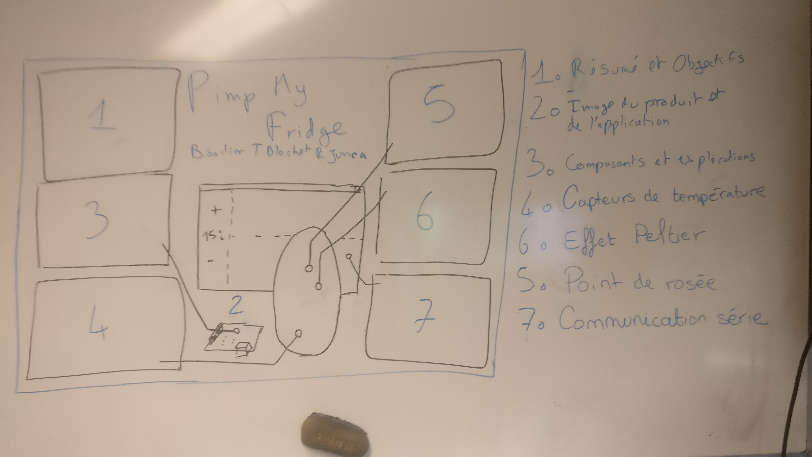

# Pimp my fridge

*Pimp my fridge* est un projet de 3e année dont l'objectif est de créer un circuit de refroidissement intelligent a l'aide d'une Arduino contrôlée par une application Java sur l'ordinateur connecté.

## Installation du projet Java

1. Ouvrir le dossier `Pimp-my-fridge-java` en tant que projet sur votre IDE.
2. Téléchargez les dépendances :
    - *openjfx* disponible sur AUR
    - *RXTX* disponible sur AUR
    - *Json-java* disponible sur [Maven](https://search.maven.org/remotecontent?filepath=org/json/json/20170516/json-20170516.jar)
3. Ajouter *JavaFx*, *RXTX* et *Json-java* au classpath de l'application
4. Exécutez avec la class principale `fr.epickiwi.pmf.Main`

## Organisation

### Cahier des charges

* Poster
    - Explication des concepts physiques utilisés
    - Effet Peltier
    - Système asservi
    - Régulateur
    - Calcul de Steinhart-Hart
    - Point de rosée
    - Code Arduino
    - Code client
* Vidéo de présentation
    - Calculs
    - Montage
    - Développement Arduino
    - Développement client
    - Présentation général
    - Publicité (optionnel)
    - Upload sur youtube
* Réfrigérateur USB
    - Refroidir et maintenir une température de consigne donnée
    - Éviter la condensation
    - Contrôler le module Peltier
        + MOSFET
    - Analyser l'humidité du réfrigérateur
        + Hygromètre
    - Analyser la température du réfrigérateur
        + Thermistance
        + Diode
* Code Arduino
    - Récupération des données des capteurs
    - Régulation de la tension sur le module Peltier
    - Transmission des données en série
    - Adaptation de la température sur une température donnée en série
    - Calcul de la température
        + Steinhart-Hart
* Application client
    - Configuration du port à écouter
    - Configuration de la consigne
    - Interface graphique
        + Affichage de la température
        + Affichage de l'humidité
        + Temps restant avant atteinte de la consigne (optionnel)
        + Affichage du point de rosée
        + Bloquer la consigne au dessus du point de rosée
        + L'évolution de la température en fonction du temps
        + L'évolution de l'humidité en fonction du temps
    - Gestion du port série
        + Réception des valeurs des capteurs
        + Envoie de la consigne
* Soutenance
    - Présentation de la vidéo
    - Présentation rapide du projet
    - Démo

### Timeline

* *Lundi 16 octobre* Début du projet
    - Storyboard vidéo
    - Design poster
* *Mardi 17 octobre* 
    - Montages
    - Calculs
* *Mercredi 18 octobre* 
    - Fin du développement de la communication série
    - Poster
* *Jeudi 19 octobre* 
    - Fin du développement client & Arduino
    - Poster
    - Montage vidéo
    - Rapport
* *Vendredi 20 octobre* 
    - *12h* Rendu de la vidéo, du poster et du rapport
    - Amélioration code
    - Debuggage code
* *Lundi 23 octobre* Soutenance

## Vidéo de présentation

* Interview des créateurs en mode Steve Trabajo
* Timelapse jour après jour
    - Timelapse du montage en gros plan
    - Scene d'un contributeur entrain de coder
    - Scene d'un contributeur en train de monter le frigo
    - Scene d'un contributeur en train de calculer
* Scène de présentation du mini-frigo en rotation avec une musique épique
* Publicité coca-cola

## Design poster

